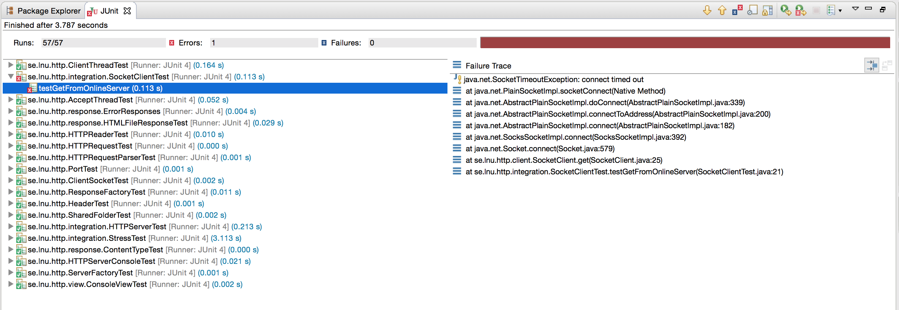

# MyWebServer-Test-Analysis
Prepared by: _John Doe (Test-Lead)_
Version: 1.0.0
Project name: MyWebServer-Test-Analysis

### Abstract

This report contains a detailed test strategy, test plan, test cases and test report for the web server application MyWebServer.


###  Table of contents
* [Test Strategy](#test-strategy)
* [Test Plan](#test-plan)
* [Test Cases](#test-cases)
* [Test Report](#test-report)

___

# Test Strategy
####   Contents
* [1. Related documents](#1.-related-documents)
    * [Glossary](#glossary)
* [2. Roles](#2.-roles)
* [3. Introduction](#3.-introduction)
    * [Purpose](#purpose)
    * [Project Overview](#project-overview)
    * [Testing objectives](#testing-objectives)
* [4. Test levels and test types](#4.-test-levels-and-test-types)
    * [Test levels](#test-levels)
    * [Test types](#test-types)
* [5. Pass/Fail criteria](#5.-passfail-criteria)
    * [Entry Criteria](#entry-criteria)
    * [Exit Criteria](#exit-criteria)
* [6. Project Conditions](#6.-project-conditions)
    * [Assumptions](#assumptions)
* [7. Proposed testing approach](#7.-proposed-testing-approach)
    * [Test iterations and deadlines](#test-iterations-and-deadlines)
    * [Defect Management](#defect-management)
    * [Test Environment](#test-environment)
    * [Testing risks and mitigation](#testing-risks-and-mitigation)
    * [Test reports and sign off procedure](#test-reports-and-sign-off-procedure)
    * [Staff Resources](#staff-resources)

## 1. Related documents
| #Ref | Document                  |
|------|---------------------------|
| 01   | WebServerRequirements.pdf |

### Glossary
| Term | Definition               |
|------|--------------------------|
| JIRA | Incident management tool |

## 2. Roles
**Test lead**: Responsible for testing and for creating this documentation
**Product owener:** Expert in the bussiness logic for Software Development Company (SDC).

## 3. Introduction

### Purpose
This document is a high level presentation of the test approach to be undertaken in relation to the MyWebServer. Once formally accepted by the product owner at Software Development Company (SDC), this document will be used as a reference the test lead to develop a Test Plan with details of test activities resourcing and schedules.

This Test Strategy will underpin all subsequent testing activities and as such is presented for product owner at SDC for sign off as approval of the proposed approach.
  
### Project Overview
The project consists of a pre-developed web server called MyWebServer. 

### Testing objectives
The objective with the tests is to deliver a easy to deploy, well tested, open source, web server that support multiple platforms.

The requirements that the product shall provide are the following:
Req 1. The web server should be responsive under high load.
Req 2. The web server must follow minimum requirements for HTTP 1.1
Req 3. The web server must work on Linux, Mac, Windows*.
Req 4. The source code should be released under GPL-2.0.
Req 5. The access log should be viewable from a text editor.
* XP, Vista, 7, 8, 10, Server 2008

## 4. Test levels and test types

### Test levels
Test levels are used to split testing phase into logical phases and set clear boundaries for each level of testing. In this project we will test the following three levels:
- Component testing/Unit testing
- System testing
- User Acceptance Testing (UAT)

**Component testing** relates to the testing of individual software components i.e. unittests created by developers. In the MyWebServer code base there are already pre-existing unittests that coveres all the component testing we need.

**System testing** is done to ensure that the whole system works when integrated.  

**User Acceptance Testing** is done togheter with the product owner to establish confidence in the system. The product owner will also help to create test cases with help from the expert bussiness logic knowledge that he pocess.

### Test types
This table describes all the types of testing that shall be performed for the different levels.

| Test Types          | Component Testing | System Testing | UAT |
|---------------------|-------------------|----------------|-----|
| Static test         | Yes               |                |     |
| Functional test     | Yes               | Yes            | Yes |
| Non-functional test |                   | Yes            | Yes |
| Security test       |                   |                | Yes |
| Negative test       | Yes               | Yes            |     |

All component tests and some of the system tests will be automated.

## 5. Pass/Fail criteria
Test Scripts will be developed as a part of every test case. The test scripts will contain test steps, expected results, pass criteria and fail criteria. 
Broadly speaking, deviation from what is written in a functional / technical specification will be considered a defect. A defect might not always result in failure.
Where a defect is identified, a defect record will be raised for each deviation between the test result and the expected result recorded in the test scripts, which are in turn based on the relevant functional / technical specification. 
If the incident is investigated and found not to be an error, the defect will be assigned back to the test lead for closure. 
If the incident is found to be a real error, it will be prioritised based on input from the relevant developers and product owner.

### Entry Criteria
Since the product is already created and we have the requirements in the document WebServerRequirements(#Ref-01) we can start testing immediately.

### Exit Criteria
These are the minimum acceptable conditions before promoting the MyWebServer solution to a live production environment:

- There are no outstanding high priority issues
- All Test Cases have been successfully executed
- Test coverage of 80% has been completed

## 6. Project Conditions
### Assumptions
The following assumptions have been made in preparing this test strategy:
- The test environment will be available at the start of the testing period.
- Technical resources will be available to provide support for the resolution of project issues/defects.
- The requirements in WebServerRequirement(#Ref-01) are not to be changed.

## 7. Proposed testing approach
### Test iterations and deadlines
Tests iterations will be done in two iterations, since the product is already developed we need one iteration to identify errors and another to rerun the tests after issues are fixed. The test plan will prioritise testing and include dates.

### Defect Management
The detection, management and resolution of defects will be properly created and progressed using JIRA.
All defects must be assessed to determine a severity level as described in the table below.

| Severity | Severity Description               |
|----------|------------------------------------|
| High     | MyWebServer crashes                |
| Medium   | Major system component is unusable |
| Low      | Incorrect or incomplete logic      |


### Test Environment
The following test environments will be used:

| Type      | Test environment | Description                                                                                                                                |
|-----------|------------------|--------------------------------------------------------------------------------------------------------------------------------------------|
| Automated | SauceLabs        | Cloud service that provides images for all different operating systems that we need.  Linux, Mac, Windows XP, Vista, 7, 8, 10, Server 2008 |
| Manual    | OSX              | MacBook Pro with OSX and Chrome webbrowser                                                                                                 | 

### Testing risks and mitigation
Some risks are identified:
 - The test lead that will execute test cases only have OSX as test enironment.
 - Since this is a fiction test Strategy the automated tests will run locally on the Test Leads OSX machine.

### Test reports and sign off procedure
These following artifacts will delivered as a sign off procedure:
- Test strategy
- Test plan 
- Test cases 
- Test report

### Staff Resources
The resources allocated to this testing project is the following:
 - Test Lead, allocated one man week (40 hours) 

----
---
# Test Plan

### Contents
* [1. Introduction](#1.-introduction)
    * [Purpose](#purpose)
    * [Project Overview](#project-overview)
* [2. Testing objectives](#2.-testing-objectives)
    * [Features to be tested](#features-to-be-tested)
    * [Features Not to be tested and constraints](#features-not-to-be-tested-and-constraints)
* [3. Testing Approach](#3.-testing-approach)
    * [Static Testing](#static-testing)
    * [Component Testing](#component-testing)
    * [System Testing](#system-testing)
    * [User Acceptance Testing (UAT)](#user-acceptance-testing-uat)
* [4. Defect Management](#4.-defect-management)
    * [Defect Status](#defect-status)
    * [Defect Severity Levels](#defect-severity-levels)
* [5. Test Activities and Schedules](#5.-test-activities-and-schedules)
* [6. Test Deliverables](#6.-test-deliverables)
* [7. Test Reporting](#7.-test-reporting)
* [8. Testing Resources](#8.-testing-resources)
* [9. Testing Tools](#9.-testing-tools)

## 1. Introduction
This test plan document describes the scope, approach, resources and schedule of intended testing activities to be undertaken for MyWebServer. This document should be read in conjunction with the Test Strategy.

### Purpose
This document provides the following guidance:
- Testing Scope
- Entry and exit criteria for each test level
- A description of resources and tools to be used to conduct testing;
- An overview of test schedules per development cycle;
- An overview of the types of testing that is to be conducted;
- Defect management work flow.

### Project Overview
The project consists of a pre-developed web server called MyWebServer.

## 2. Testing objectives
The objective with the tests is to deliver a easy to deploy, well tested, open source, web server that support multiple platforms.

The requirements that the product shall provide are the following:
- Req 1. The web server should be responsive under high load.
- Req 2. The web server must follow minimum requirements for HTTP 1.1
- Req 3. The web server must work on Linux, Mac, Windows*.
- Req 4. The source code should be released under GPL-2.0.
- Req 5. The access log should be viewable from a text editor.

*XP, Vista, 7, 8, 10, Server 2008

### Features to be tested
- Req 1. The web server should be responsive under high load.
- Req 2. The web server must follow minimum requirements for HTTP 1.1
- Req 3. The web server must work on Mac. (Part of Req 3.)
- Req 4. The source code should be released under GPL-2.0.
- Req 5. The access log should be viewable from a text editor.

*XP, Vista, 7, 8, 10, Server 2008

### Features Not to be tested and constraints
- Req 3. The web server must work on Linux, Windows*. (Part of Req 3.)

*XP, Vista, 7, 8, 10, Server 2008

This requirement cannot be tested due to the Test Lead does not have the correct hardware/environment to perform this test. 

## 3. Testing Approach

### **Static Testing**
Static testing is testing of a component or specifications without execution of that software. This is usually done as soon as acceptance criteria or business requirements are ready for review before code implementation such as conflicting rules, invalid data types, redundant process just to name a few.

### **Component Testing**
Component level testing focuses on the functionality of each component being developed. This is crucial where different components are being developed before they are integrated together as one system.

#### Entry Criteria
Component Testing may commence when the following criteria have been satisfied:
 - All codes have been unit tested and passed.
 - Test environment including software have been setup and configured correctly.

#### Suspension Criteria
Component testing will be suspended under the following condition:
 - Critical error(s) found preventing test completion.
 - Change of business requirements.
 - Change of environment components or technology including different version.

#### Resumption Criteria
Component testing will resume when the following criteria are met:
 - All issues in suspension criteria have been resolved or mitigated
 - New build with fixed Critical and Medium severity defects has been delivered to test.

#### Exit Criteria (Test Completeness)
Component testing can be considered complete when the following conditions have been met:
 - All High and Medium priority requirements have been tested without Critical or Medium severity defects.

### **System Testing**
The purpose of the system testing is to validate that the complete and integrated system complies with functional requirements and business requirements.

#### Entry Criteria
System testing may commence when the following criteria have been satisfied:
 - Component Testing has been completed.

#### Suspension Criteria
System Testing will be suspended under the following condition:
 - Critical error(s) found affecting functionality of the whole system.

#### Resumption Criteria
System Testing will resume when the following criteria have been satisfied:
 - All issues in suspension criteria have been resolved or mitigated
 - New build with fixed Critical and Medium severity defects has been delivered to test.

#### Exit Criteria (Test Completeness)
System Testing will be considered complete when the following conditions have been met:
 - All High and Medium priority requirements have been tested without Critical or Medium severity defects.
 - All defects found during testing have been recorded in the test report.

### **User Acceptance Testing (UAT)**
UAT is a formal testing with respect to user needs, business requirements and expectations. The idea here is to gain confidence from business owner on the software being developed. Although it is not mandatory business owner(s) and/or business user(s) are expected to produce his/her own test scenarios.

## 4. Defect Management
#### Defect Status
Every defect must be assigned a status to identify its place in the defect management workflow.

| Status      | Description                                                         |
|-------------|---------------------------------------------------------------------|
| New         | Issue created                                                       |
| Active      | Issue assigned to dev                                               |
| Resolved    | Issue fixed and delivered to test                                   |
| Investigate | Issue needs investigation before it can get status Active or Closed |
| Closed      | Issue will not be fixed or is marked as a non issue                 |

#### Defect Severity Levels
Every defect must be assigned a severity level according to the following table. If the tester is unsure what level to assign to a defect, then advice must be taken from the product owner.

| Level | Description |
|-------|-------------|
| 1     | High        |
| 2     | Medium      |
| 3     | Low         |

## 5. Test Activities and Schedules
#### Week 1 (12/Dec/16 - 16/Dec/16)

| Activities            | Exit Criteria               | Priority | Status | Responsible Resource |
|-----------------------|-----------------------------|----------|--------|----------------------|
| Develop Test Strategy | Document completed          | High     | Done   | Test Lead            |
| Develop Test Plan     | Document completed          | High     | Done   | Test Lead            |
| Develop Test Cases    | Test case scripts completed | High     | Done   | Test Lead            |
| Execute Test Cases    | All test cases executed     | High     | Done   | Test Lead            |
| Write Test Report     | Document completed          | High     | Done   | Test Lead            |

## 6. Test Deliverables
Testing Team will provide specific deliverables during the project.  These deliverables fall into the following basic categories: 
 - Test Strategy and Test Plan 
 - Test Cases
 - Test Report

## 7. Test Reporting
The following test report will be delivered:
- A Final Test Summary Report will be issued by the Test Leas. It will certify the extent to which testing has been completed.

## 8. Testing Resources
John Doe - Test Lead
Responsible for the complete test project.

## 9. Testing Tools

| Name                   | Description                                                                                                                                                                                      |
|------------------------|--------------------------------------------------------------------------------------------------------------------------------------------------------------------------------------------------|
| JUnit                  | Is used for unit/component testing                                                                                                                                                               |
| JMeter                 | Is used for load testing the webserver                                                                                                                                                           |
| Postman                | Used for manually testing requests against the webserver                                                                                                                                         |
| Chrome Developer Tools | Is used to inspect information in the request/responses in the webserver                                                                                                                         |
| Charles Proxy          | Is used to inspect information in the request/responses in the webserver. Easier to save history and to inspect more details than Chrome Developer Tools, it also works for both HTTP and HTTPS. |

----
----

# Test Cases

* [TC1 - Start Web Server](#tc1---start-web-server)
* [TC2 - Start Web Server - Alt. scenario 1](#tc2---start-web-server---alt.-scenario-1)
* [TC3 - Start Web Server - Alt scenario 2](#tc3---start-web-server---alt-scenario-2)
* [TC4 - Start Web Server - Alt scenario 3](#tc4---start-web-server---alt-scenario-3)
* [TC5 - Stop Web Server](#tc5---stop-web-server)
* [TC6 - Request shared resource](#tc6---request-shared-resource)
* [TC7 - Request shared resource - Alt scenario 1](#tc7---request-shared-resource---alt-scenario-1)
* [TC8 - Request shared resource - Alt scenario 2](#tc8---request-shared-resource---alt-scenario-2)
* [TC9 - Request shared resource - Alt scenario 3](#tc9---request-shared-resource---alt-scenario-3)
* [TC10 - Request shared resource - Alt scenario 4](#tc10---request-shared-resource---alt-scenario-4)

### TC1 - Start Web Server
Description: Administrator should successfully start the webserver.

##### Preconditions: 
 - User have admin priviledges
 - MyWebServer project is opened as a project in eclipse

##### Assumption: 
Eclipse is installed.

##### Test Steps:
1. Open Run Configurations
2. Create a new Java Application Configuration.
3. Choose **se.lnu.http.HTTPServerConsole** as *Main class* under tab *Main*.
4. Select tab *Arguments*.
5. Under *Program Arguments* add the following arguments: 1091 *path_to_MyWebServer_project_root*/WebServer/tests/se/lnu/http/resources/inner
6. Click button *Run*

##### Expected Result:
* A web server has been started
* A note in the access log was written, that the server was started i.e.:
```bash 
HTTP Server object constructed
HTTP Server started
Accept
```
### TC2 - Start Web Server - Alt. scenario 1
Description: The web server could not be started due to socket was taken

##### Preconditions: 
 - User have admin priviledges
 - MyWebServer project is opened as a project in eclipse
 - MyWebServer is started on port *1091*

##### Assumption: 
Eclipse is installed.

##### Test Steps:
1. Open Run Configurations
2. Create a new Java Application Configuration.
3. Choose **se.lnu.http.HTTPServerConsole** as *Main class* under tab *Main*.
4. Select tab *Arguments*.
5. Under *Program Arguments* add the following arguments: 1091 *path_to_MyWebServer_project_root*/WebServer/tests/se/lnu/http/resources/inner
6. Click button *Run*

##### Expected Result:
* No new webserver will be started
* A note in the access log was written, that the port is taken i.e.:
```bash 
HTTP Server object constructed
Socket 1091 was taken
```

### TC3 - Start Web Server - Alt scenario 2
Description: The web server could not be started due restriction on the shared resource container

##### Preconditions: 
 - User have admin priviledges
 - MyWebServer project is opened as a project in eclipse

##### Assumption: 
Eclipse is installed.

##### Test Steps:
1. Open console and goto: *path_to_MyWebServer_project_root*/WebServer/tests/se/lnu/http
2. Run the following command: ``` chmod 0600 resources```
2. Open Run Configurations
2. Create a new Java Application Configuration.
3. Choose **se.lnu.http.HTTPServerConsole** as *Main class* under tab *Main*.
4. Select tab *Arguments*.
5. Under *Program Arguments* add the following arguments: 1091 *path_to_MyWebServer_project_root*/WebServer/tests/se/lnu/http/resources/inner
6. Click button *Run*

##### Expected Result:
* The webserver could not be started
* The following message will be displayed in the console: 
```bash 
No access to folder *path_to_MyWebServer_project_root*/WebServer/tests/se/lnu/http/resources/inner
```

##### Cleanup:
1. Open console and goto: *path_to_MyWebServer_project_root*/WebServer/tests/se/lnu/http
2. Run the following command: ``` chmod 0755 resources```

### TC4 - Start Web Server - Alt scenario 3
Description: The access log could not be written to *path_to_MyWebServer_project_root*/logs

##### Preconditions: 
 - User have admin priviledges
 - MyWebServer project is opened as a project in eclipse

##### Assumption: 
Eclipse is installed.

##### Test Steps:
1. Open console and goto: *path_to_MyWebServer_project_root*
2. Run the following command: ``` chmod 0600 logs```
2. Open Run Configurations
2. Create a new Java Application Configuration.
3. Choose **se.lnu.http.HTTPServerConsole** as *Main class* under tab *Main*.
4. Select tab *Arguments*.
5. Under *Program Arguments* add the following arguments: 1091 *path_to_MyWebServer_project_root*/WebServer/tests/se/lnu/http/resources/inner
6. Click button *Run*

##### Expected Result:
* The webserver is started
* No access log could be created by server in directory *path_to_MyWebServer_project_root*/logs

##### Cleanup:
1. Open console and goto: *path_to_MyWebServer_project_root*
2. Run the following command: ``` chmod 0755 logs```

### TC5 - Stop Web Server
Description: A user successfully stops the web server.

##### Preconditions: 
 - User have admin priviledges
 - MyWebServer project is started in eclipse

##### Assumption: 
Eclipse is installed and started.

##### Test Steps:
1. Open up the eclipse workspace where the MyWebServer is running.
2. Make sure that the console view is opened and that it is in focus.
3. Click the red square shaped button (tooltop text: terminate).

##### Expected Result:
* The webserver is stopped
* A note in the access log was written, that the server was stopped.

### TC6 - Request shared resource
Description: A resource is successfully shared with the browser.

##### Preconditions: 
 - Chrome browser is used.
 - MyWebServer project is started on port `1091` in eclipse.

##### Assumption: 
Chrome is opened.

##### Test Steps:
1. Browse to `localhost:1091`

##### Expected Result:
* Chrome browser shall show the text `It works`, the image works.png and the imaget works2.png.

* In eclipse, in the console view shall show information that access happened with request information and the result of the request.

### TC7 - Request shared resource - Alt scenario 1
Description: A shared resource cannot be found.

##### Preconditions: 
 - Chrome browser is used.
 - MyWebServer project is started on port `1091` in eclipse.

##### Assumption: 
Chrome is opened with the developer tools `network`tab in focus.

##### Test Steps:
1. Rename the file *path_to_MyWebServer_project_root*/WebServer/tests/se/lnu/http/resources/inner/images/works.png to temp.png
2. Browse to `localhost:1091`

##### Expected Result:
* Chrome browser shall show the text `It works`and the image works2.png.

* The network tab shall show the status of the requests made to the server by the browser where the following shall apply:
  - ``` Request URL: http://localhost:1091/ ``` shall have status code `200`
  - ``` Request URL: http://localhost:1091/images/works.png``` shall have status code `404`
  - ``` Request URL:http://localhost:1091/images/works2.png```shall have the status code `200`

### TC8 - Request shared resource - Alt scenario 2
Description: A shared resource is outside of the shared resource directory.

UC 2b: The shared resource is outside the shared resource container is not a valid UC since the shared resource container is the root of the application and the client cannot access anything outside of the resource container by default.

### TC9 - Request shared resource - Alt scenario 3
Description: A shared resource request is invalid or malformed.

##### Preconditions: 
  - MyWebServer project is started on port `1091` in eclipse.

##### Assumption: 
The user have access to use curl commands on client.

##### Test Steps:
1. Open console/terminal
2. Enter the following command: `curl localhost:1091 http://localhost:works.png --header "Content-Type:application/json"`

##### Expected Result:
* The following html shall be displayed in the console:
```html 
<html><body><h1>400 Bad request</h1></body></html><html><body><h1>400 Bad request</h1></body></html> 
```

### TC10 - Request shared resource - Alt scenario 4
Description: The server encounters an error when trying to process the request.

##### Preconditions: 
  - MyWebServer project is started on port `1091` in eclipse.

##### Assumption: 
The user have access to use curl commands on client.

##### Test Steps:
1. Open console/terminal
2. Use curl to invoke error on server.

##### Expected Result:
* The console should display that you get a response code `500`back from the server.

---
---

# Test Report

### Component and Integration Test Cases



There is one failing test in the integration tests:
- SocketClientTest.testGetFromOnlineServer
    - Problem is that the server 194.47.172.159 is not online
    - **ACTION**: Create ticket with IT to make sure this server is online.

### Manual Test Cases

| Test Case ID                                   | Date Tested | Tester   | Pass/Fail | Severity of Defect | Summary of Defect                                                                 | Comments                                                                                                                                                              |
|------------------------------------------------|-------------|----------|-----------|--------------------|-----------------------------------------------------------------------------------|-----------------------------------------------------------------------------------------------------------------------------------------------------------------------|
| TC1 - Start Web Server                         | 18-12-16    | John Doe | Pass      | -                  | -                                                                                 | -                                                                                                                                                                     |
| TC2 - Start Web Server - Alt. scenario 1       | 18-12-16    | John Doe | Pass      | -                  | -                                                                                 | -                                                                                                                                                                     |
| TC3 - Start Web Server - Alt scenario 2        | 18-12-16    | John Doe | Pass      | -                  | -                                                                                 | -                                                                                                                                                                     |
| TC4 - Start Web Server - Alt scenario 3        | 18-12-16    | John Doe | Fail      | low                | MyWebServer is not saving the access logs to a file.                              | Create bug report to dev team to implement functionality to store access logs to file under the path path_to_MyWebServer_project_root/logs                            |
| TC5 - Stop Web Server                          | 18-12-16    | John Doe | Fail      | low                | MyWebServer is not printing a note to the access log that the server was stopped. | Create bug report to dev team to implement functionality to print the message `Server successfully stopped`to the access log when server stops.                       |
| TC6 - Request shared resource                  | 18-12-16    | John Doe | Fail      | low                | MyWebServer is not printing request and response information to the access log.   | Create bug report to dev team to implement functionality to print the message information on the request and response to the access log.                              |
| TC7 - Request shared resource - Alt scenario 1 | 18-12-16    | John Doe | Pass      | -                  | -                                                                                 | -                                                                                                                                                                     |
| TC8 - Request shared resource - Alt scenario 2 | 18-12-16    | John Doe | Fail      | -                  | -                                                                                 | Not a valid UC since the shared resource container is the root of the application and the client cannot access anything outside of the resource container by default. |
| TC9 - Request shared resource - Alt scenario 3 | 18-12-16    | John Doe | Pass      | -                  | -                                                                                 | -                                                                                                                                                                     |
| TC10 -Request shared resource - Alt scenario 4 | 18-12-16    | John Doe | Fail      | Medium             | MyWebServer does not support the response code 500.                               | Create bug report to dev team to implement functionality to support response code 500 and so that when an unknown error occurs the server shall respond with a 500.   |


